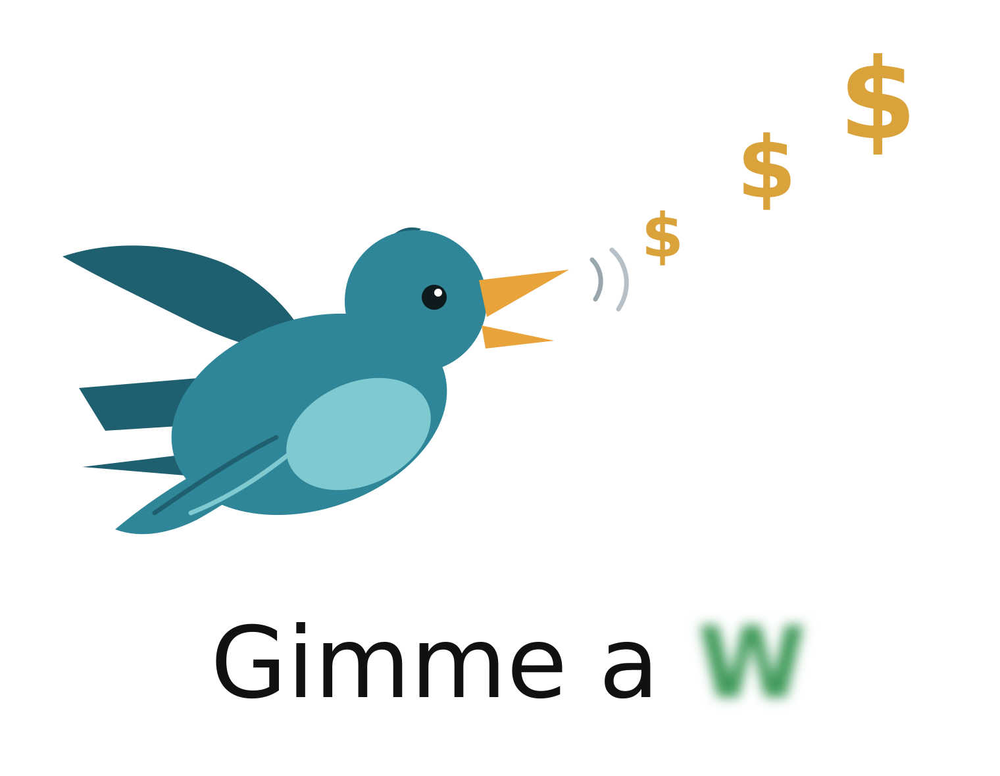

<p align="center">
  
</p>

# gimme-a-W

**Live:** https://gimme-a-w-web.vercel.app

A sports prediction web app. It **collects** statistics, team and player form, betting lines and expert picks
from public sports sites (ESPN, Sports-Reference, SI.com and structured sports APIs), then **predicts** game
outcomes and player performance for three verticals:

- ⚽ **Soccer, worldwide** — top domestic leagues, continental cups, international tournaments
- 🏈 **NFL**
- 🏈 **College football (NCAA FBS)**

Before any game, open one page and see who is likely to win or draw, who is likely to score, and what the
totals should look like: goals, corners, shots on target, passing, rushing and receiving yards.

---

## Table of contents

1. [Tech stack](#tech-stack)
2. [Data sources](#data-sources)
3. [Architecture](#architecture)
4. [Prediction engine](#prediction-engine)
5. [Domain model](#domain-model)
6. [Repository layout](#repository-layout)
7. [Local setup](#local-setup)
8. [Environment variables](#environment-variables)
9. [Roadmap](#roadmap)
10. [Legal and etiquette](#legal-and-etiquette)

---

## Tech stack

The app is a **hybrid TypeScript + Python** monorepo. The web layer is TypeScript because it deploys anywhere
and renders fast; the data-collection and modeling layers are Python because that is where the sports-data
and statistics ecosystems live.

| Layer | Choice | Why |
|---|---|---|
| Web app | **Next.js 15** (App Router) + **TypeScript** + **Tailwind CSS** + **shadcn/ui**, mobile-first and installable as a **PWA** | Server rendering and ISR for score/stat/prediction pages, responsive layouts that work on a phone at the stadium, one-click deploy on Vercel |
| Collectors | **Python 3.12+** with `httpx`, `selectolax` (HTML parsing), `pydantic` (validation), `Playwright` only when a page needs JavaScript | Existing libraries already wrap the sources we care about: [`soccerdata`](https://github.com/probberechts/soccerdata) (FBref, ESPN, Understat, FotMob, Sofascore, WhoScored), [`nflreadpy`](https://github.com/nflverse/nflreadpy) (nflverse), [`cfbd`](https://github.com/CFBD/cfbd-python) (CollegeFootballData) |
| Prediction models | **Python**: `polars`/`pandas`, `numpy`, `scipy`, `statsmodels`, `scikit-learn`, `lightgbm` | Poisson and negative-binomial models for goals, corners, shots; gradient boosting for yards; everything back-testable with standard tooling |
| Database | **PostgreSQL** on [Neon](https://neon.tech) | Relational data with lots of joins (team × season × game × stat); free tier is enough for v1 |
| Schema / migrations | **Drizzle ORM** (`packages/db`) is the single source of truth; Python writes through `psycopg` | One schema definition, typed queries on the web side, plain SQL upserts on the collector side |
| Scheduling | **GitHub Actions cron** for v1; move to a small worker (Railway / Fly.io + APScheduler) if we need sub-hourly runs | Zero infrastructure, logs live next to the code |
| HTTP cache | On-disk cache inside the fetcher + a `raw_page` table storing fetched HTML/JSON | Re-parse without re-fetching, stay under source rate limits, reproducible debugging |
| Package managers | `pnpm` (workspace) and `uv` (Python) | Fast, lockfile-based, monorepo-friendly |
| Tooling | ESLint + Prettier, `ruff` + `mypy`, `pytest`, `vitest` | Standard, fast, low-config |
| Hosting | Vercel (web) · Neon (db) · GitHub Actions (collectors + model runs) | Everything on free tiers to start |

**Alternative considered:** an all-TypeScript setup (Node worker with `cheerio` + BullMQ + Redis). Simpler to
maintain in one language, but it means re-implementing the scrapers and the statistical models that the
Python ecosystem already provides. Not worth it for a prediction product.

---

## Data sources

Each source is wrapped by one adapter under `collectors/gimme_collectors/sources/`. Adapters share one
interface (`fetch → parse → normalize → upsert`) and emit the unified domain model below.

### Primary sources

| Source | Covers | How we access it | Limits / notes |
|---|---|---|---|
| **ESPN** | Soccer (dozens of leagues), NFL, college football — scores, fixtures, standings, rosters, box scores, FPI predictions | Unofficial but stable JSON endpoints under `site.api.espn.com/apis/site/v2/sports/{sport}/{league}/…` (e.g. `soccer/eng.1`, `football/nfl`, `football/college-football`) | No key required. Undocumented, so pin response shapes with tests. **First adapter to build**: one integration covers all three verticals |
| **Sports-Reference** (FBref, Pro-Football-Reference, CFB Reference) | Deep historical and advanced stats: shots on target, xG, per-player shooting, NFL/CFB player game logs | Throttled HTML scraping of stat tables; `soccerdata` handles FBref throttling for us | **Hard limit: ~20 requests/minute or IP ban.** Terms forbid commercial use without a license. Cache every page |
| **SI.com** and other editorial sites | Previews, expert picks, injury news, form commentary | RSS feeds + article HTML, honoring `robots.txt` | We store a short summary, the URL and the teams mentioned — never the full text (copyright) |

### Structured sources the models depend on

| Source | Covers | Key | Free tier | Feeds which predictions |
|---|---|---|---|---|
| [nflverse](https://github.com/nflverse/nflverse-data) | NFL play-by-play, targets, carries, snap counts, rosters, injuries (CSV/parquet) | No | Unlimited (static files) | Win probability, anytime TD, passing/rushing/receiving yards |
| [CollegeFootballData.com](https://collegefootballdata.com) | NCAAF games, drives, plays, player stats, SP+ and Elo ratings, betting lines | Yes (free) | Generous | Same markets for college football |
| [football-data.co.uk](https://www.football-data.co.uk/data.php) | Historical CSVs since 1993 for 22+ leagues: results, **shots on target, corners**, closing odds | No | Unlimited (static files) | Back-testing of 1X2, totals, corners and shots models |
| [Understat](https://understat.com) | Shot-level xG for the top-5 leagues (via `soccerdata`) | No | Be polite | Goals, goalscorer, shots on target |
| [football-data.org](https://www.football-data.org) | Fixtures, standings and scorers for 12 major soccer competitions | Yes (free) | 10 req/min | Fixture list, lineups |
| [The Odds API](https://the-odds-api.com) | Bookmaker lines for all three sports | Yes | 500 req/month | Market baseline every model is measured against |

---

## Architecture

```
            ┌──────────────────────── GitHub Actions (cron) ────────────────────────┐
            │  python -m gimme_collectors run espn --sport nfl                      │
            │  python -m gimme_collectors run fbref --competition ENG-Premier-League │
            │  python -m gimme_predict   run --sport soccer --date today            │
            └───────────────┬───────────────────────────────────────────────────────┘
                            │ fetch (cached, rate-limited)
   ESPN · Sports-Reference · SI · CFBD · nflverse · football-data.co.uk · Odds API
                            │ parse → pydantic models → normalize ids → upsert
                            ▼
                   PostgreSQL (Neon)  ◄──── Drizzle schema + migrations
                            │
                            │ features → models → predictions (per game, team, player, market)
                            ▼
            Next.js 15 (Vercel) — server components read via Drizzle, ISR pages
            /  /soccer  /nfl  /cfb  /games/[id]  /teams/[id]  /players/[id]  /models
```

Key design rules:

- **Raw first, parse second.** Every fetched page/JSON is stored in `raw_page` with a hash and timestamp. Parsers run against stored raw data, so a parser bug never forces a re-scrape.
- **One id to rule them all.** Internal ids are ours; every source id lives in the `external_id` mapping table. Cross-source joins (ESPN roster + FBref stats + odds) go through that table.
- **Provenance everywhere.** Every row carries `source_id` and `collector_run_id`; every prediction carries `model_run_id`, so a bad run can be rolled back.
- **Idempotent upserts.** Collectors and model runs can be re-run for the same day/week without duplicating rows.
- **Point-in-time features.** A prediction for a game only uses data available before kickoff. This is what makes back-tests honest.

---

## Prediction engine

The engine lives in `collectors/gimme_predict/`. Every market is a small, explainable model built on the
collected data, and every model is measured against the bookmaker line as the baseline.

### Markets

| Market | Sport | Output | Model |
|---|---|---|---|
| **Match result** (home / draw / away) | Soccer | Three probabilities | Dixon-Coles bivariate Poisson on team attack/defense strengths, time-decayed, blended with bookmaker implied probabilities |
| **Win probability** and spread | NFL, CFB | Home win probability, expected margin | Elo with margin of victory + LightGBM on efficiency features (EPA per play, success rate, rest days, injuries), calibrated against closing lines |
| **Total goals** | Soccer | Expected goals per team, over/under probabilities for 1.5 / 2.5 / 3.5 | Same Poisson strengths as match result; xG-adjusted |
| **Anytime goalscorer** | Soccer | Probability per player | Player's xG per 90 × expected minutes × share of team's expected goals; Poisson |
| **Shots on target** | Soccer | Expected count per team, over/under lines | Negative-binomial regression on team and opponent rates, home advantage, game state |
| **Total corners** | Soccer | Expected count, over/under lines | Negative-binomial regression on team corner rates for and against, possession, tempo |
| **Anytime touchdown scorer** | NFL, CFB | Probability per player | Red-zone target and carry share × team expected touchdowns; Poisson |
| **Passing / rushing / receiving yards** | NFL, CFB | Expected yards per player with 25th–75th percentile range | LightGBM quantile regression on usage (target share, carries, snap %), opponent defense EPA allowed, expected game script (spread, total), weather |
| **Total points** | NFL, CFB | Expected total, over/under probability | Team pace and efficiency features, calibrated against the closing total |

### How a prediction is produced

1. **Feature snapshot.** `features.py` builds one row per game (and per player) using only data timestamped before kickoff: last-N form, season rates, ratings, injuries, odds.
2. **Model run.** Each market model reads the snapshot, writes rows to `prediction` with `mean`, `probability`, `line`, `quantiles` and `model_version`.
3. **Ensemble.** When third-party numbers exist (ESPN FPI, SP+, closing odds) they enter as features or as a blend weight, never as the answer.
4. **Scoring.** After results land, `evaluate.py` scores every prediction: log loss and Brier for probabilities, MAE and coverage for counts and yards, and always side-by-side with the bookmaker baseline. Results feed the `/models` page.
5. **Explanation.** Each prediction stores its top feature contributions so the UI can say *why* (e.g. "Arsenal 1.9 xG: strong home attack, opponent conceding 1.6 xG per game, no defensive injuries").

### What "good" looks like

- Match result and win probability: log loss within 1–2 % of the closing line after one season of back-tests.
- Totals, corners, shots: MAE at or below the market's implied line.
- Yards: 50 % of outcomes inside the predicted 25th–75th percentile range.

Predictions are probabilities, not promises. The UI always shows the uncertainty.

---

## Domain model

| Entity | Purpose |
|---|---|
| `sport` | `soccer`, `american_football` |
| `competition` | Premier League, La Liga, NFL, NCAAF FBS, Champions League… (has `sport`, `country`, `level`) |
| `season` | A competition-year (`2025-26`, `2026`) |
| `team` | Club or program, with `competition` membership per season |
| `player` | Person; roster links to `team` + `season` |
| `game` | Fixture or result: kickoff, home/away, score, status, venue, week/round, weather |
| `team_game_stat` | Per-team box score (possession, xG, shots on target, corners, yards, turnovers…) — JSONB `stats` keyed by a per-sport dictionary |
| `player_game_stat` | Per-player box score: goals, shots, minutes, targets, carries, yards, touchdowns |
| `standing` | Snapshot of table/rankings per competition-season-date |
| `team_form` | Derived: last-N results, points-per-game, xG diff, rest days — recomputed after each run |
| `rating` | Team or player rating per date: Elo, attack/defense strength, xG per 90 |
| `odds` | Bookmaker lines per game and market with timestamp (opening and closing) |
| `feature_snapshot` | Point-in-time feature row per game/player used by a model run |
| `prediction` | `model_run`, `game`, `market`, `subject_type` (game/team/player), `subject_id`, `probability`, `mean`, `line`, `quantiles`, `explanation` |
| `model_run` | Which model version ran, when, on which snapshot, with which metrics |
| `pick` | External picks: `source`, `game`, `pick`, `win_probability`, `spread`, `published_at` (ESPN FPI, SI experts) |
| `article` | `source`, `url`, `title`, `summary`, `published_at`, linked teams/games |
| `source` | Registry of data sources with base URL, rate limit, ToS notes |
| `external_id` | `(entity_type, entity_id, source_id) → external_id` |
| `raw_page` | Cached raw payload: `url`, `fetched_at`, `content_hash`, `body` |
| `collector_run` | Provenance: which adapter ran, when, how many rows, errors |

---

## Repository layout

```
gimme-a-W/
├── apps/
│   └── web/                     # Next.js 15 app (App Router, Tailwind, shadcn/ui)
├── collectors/
│   ├── pyproject.toml           # managed with uv; both packages below
│   ├── gimme_collectors/
│   │   ├── sources/             # espn.py · sports_reference.py · si.py · cfbd.py · nflverse.py · fdcouk.py · odds.py
│   │   ├── models/              # pydantic: Team, Player, Game, TeamGameStat, Pick, Article…
│   │   ├── pipeline/            # fetch.py (cache + throttle) · normalize.py · upsert.py
│   │   └── cli.py               # python -m gimme_collectors run <source> [--sport …]
│   └── gimme_predict/
│       ├── features.py          # point-in-time feature snapshots
│       ├── ratings.py           # Elo, attack/defense strengths
│       ├── markets/             # match_result.py · totals.py · goalscorer.py · shots.py · corners.py · td_scorer.py · yards.py
│       ├── evaluate.py          # log loss, Brier, MAE, coverage vs bookmaker baseline
│       └── cli.py               # python -m gimme_predict run|backtest
├── packages/
│   └── db/                      # Drizzle schema, migrations, seed
├── .github/workflows/           # ci.yml · collect-daily.yml · predict-daily.yml · backtest-weekly.yml
├── assets/logo/                 # logo.svg (lockup with wordmark) · mark.svg (bird only, for favicon/app icon)
├── data/                        # local raw cache and model artifacts (git-ignored)
├── README.md
└── .gitignore
```

---

## Local setup

Prerequisites: **Node 20+** (24 recommended), **pnpm**, **Python 3.12+**, **uv**, **PostgreSQL** (a free Neon
branch is the easiest).

```bash
git clone https://github.com/bjhr730/gimme-a-W.git
cd gimme-a-W
```

Web app and shared packages:

```bash
pnpm install
cp .env.example .env            # fill in DATABASE_URL
pnpm --filter @gimme/db migrate # apply Drizzle migrations
pnpm --filter web dev           # http://localhost:3000
```

Collectors and models:

```bash
cd collectors
uv sync
uv run gimme-collect run espn --kind all --league nfl --league eng.1 --date yesterday --days 3
uv run gimme-collect run espn --kind roster --league nfl
uv run gimme-collect derive --what form,elo
uv run pytest
```

`--kind all` collects scoreboards, teams, standings and game summaries (box scores, lineups,
ESPN FPI picks). Rosters are separate because they cost one request per team.

Predictions (the daily workflow runs these after collecting):

```bash
uv run gimme-predict backtest --competition nfl     # season-by-season vs the closing line
uv run gimme-predict run --sport american_football  # writes predictions for the next 8 days
uv run gimme-predict run --sport soccer --dry-run   # needs ~30 finals per league to fit
```

History loads (one-off, then refreshed weekly by the workflow):

```bash
uv run gimme-collect run nflverse --seasons 2015-2026 --what games
uv run gimme-collect run nflverse --seasons 2024-2025 --what players
# soccer seasons from ESPN: one request per calendar month, results + shots + corners
uv run gimme-collect run espn --kind scoreboard --league eng.1 --date 2019-08-01 --days 2555
# closing odds from football-data.co.uk (when the site is up)
uv run gimme-collect run fdcouk --league eng.1 --league esp.1 --seasons 2015-2025
```

---

## Environment variables

| Variable | Used by | Required | Notes |
|---|---|---|---|
| `DATABASE_URL` | web, collectors, models | Yes | Neon pooled connection string |
| `DIRECT_URL` | Drizzle migrations | Yes | Neon direct (non-pooled) connection |
| `CFBD_API_KEY` | collectors | For college football | Free at collegefootballdata.com |
| `FOOTBALL_DATA_API_KEY` | collectors | Optional | football-data.org |
| `ODDS_API_KEY` | collectors | Recommended | the-odds-api.com; the models use lines as baseline |
| `COLLECTOR_CACHE_DIR` | collectors | No | Defaults to `./data/raw` |
| `MODEL_ARTIFACT_DIR` | models | No | Defaults to `./data/models` |
| `COLLECTOR_USER_AGENT` | collectors | No | Identify the bot politely, with a contact email |

Never commit `.env`. Commit `.env.example` with empty values instead.

---

## Roadmap

| Phase | Deliverable |
|---|---|
| **0 — Scaffold** (done) | README, `.gitignore`, logo, monorepo skeleton, tooling |
| **1 — Data spine** (done) | Drizzle schema + migrations · ESPN adapter for soccer/NFL/CFB · CLI · CI and daily collect workflows |
| **2 — Web v1** (done) | Mobile-first Next.js app · today's games per sport with a date strip · game pages with stats and lines · team and standings pages · search · PWA manifest and icons from the logo. Player pages wait for roster data in phase 3 |
| **3 — Depth** (done, ESPN part) | ESPN game summaries (full team box scores, per-player passing/rushing/receiving and goals/shots, soccer lineups, FPI picks) · ESPN rosters · `team_form` and Elo `rating` derivations · player pages, box scores on game pages, form/Elo/roster on team pages · weekly roster workflow |
| **3b — Historical depth** (done) | nflverse: NFL games since 2015 with closing lines, weather and rest days, weekly player stats with EPA and target share · football-data.co.uk: league seasons with shots on target, corners and Bet365/Pinnacle opening and closing odds, matched to ESPN teams by name · Elo with season regression · weekly refresh workflow. CFBD when a key is added; Sports-Reference last, under its rate limit |
| **4 — Game predictions** (done) | `gimme_predict`: point-in-time features (Elo, rest, form), logistic win probability + ridge spread and total for football, Dixon-Coles Poisson for soccer (1X2, total goals, team goals, both teams to score), 60/40 blend with the market, season-by-season back-test vs the closing line stored in `model_run`, daily prediction run · "Who gets the W" panel on game pages, model pick chips on score cards, `/models` page |
| **5 — Team and player markets** (done) | Passing/rushing/receiving yards with middle-half ranges and anytime TD (usage share, opponent allowed, market game script; holdout back-test), shots on target and corners per team and per match (negative-binomial GLM with over/under lines), anytime scorer from expected-goals share · markets panel on game pages · daily run |
| **Research search** (done) | Header search that understands teams, matchups, players, leagues and days, with keyboard navigation; `/api/search` |
| **6 — Production** (done) | Vercel + Neon + GitHub secrets · daily collect, fixtures, derive, predict, score and health-check workflow; weekly rosters, history refresh and back-tests · `/status` page (freshness per competition, collector and model runs) · live scorecard on `/models` grading published predictions against results · `gimme-collect health` fails the run so GitHub emails on stale data · error and loading states, security headers |

---

## Legal and etiquette

- Respect each site's `robots.txt` and terms of service. Sports-Reference explicitly bans scrapers above
  ~20 requests/minute and restricts commercial use; ESPN's JSON API is unofficial and may change without notice.
- Identify the collector with a descriptive `User-Agent` that includes a contact email.
- Cache aggressively; never fetch the same page twice in a day.
- Store facts (scores, stats, lines) and short summaries with attribution links. Do not republish article text.
- This project is for personal/educational use. Check licensing before any commercial use of the data.
- Predictions are statistical estimates for information only, not betting advice.
